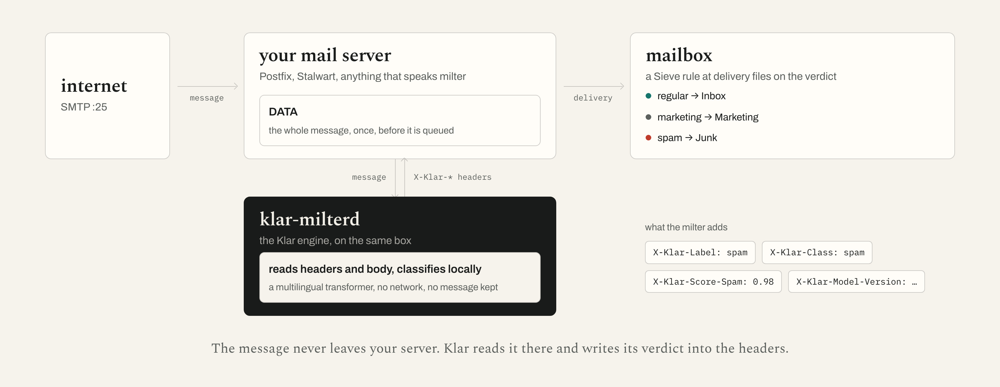

# Klar Engine

A self-hostable spam-detection engine built on a multilingual transformer
(XLM-RoBERTa) classifier. It scores mail on-device: no data leaves your server.

The engine is the core; milters embed it. This repo ships the engine, the
milter built on it (`postfix/`, one daemon for Postfix, Stalwart and any
libmilter MTA), and the Stalwart wiring (`stalwart/`: the objects that point
Stalwart at the milter, the Sieve that files on its verdict, a compose stack).

This repo is the open-core of [Klar](https://klar.im), licensed AGPLv3 (see
`LICENSE`).

## What's here

- `engine/` is the C++ inference core: a GGML/llama.cpp encoder plus a
  model-declared classifier head, with a stable C ABI
  (`engine/spam_engine_c_api.h`) for embedding in other languages.
- `postfix/` is the reference milter: a Postfix-facing daemon (config, policy,
  event store, health endpoint, CLI) plus a Docker end-to-end stack (Postfix
  and Dovecot) that shows how to embed the engine.

## Run it behind your mail server



- **Stalwart**: [`stalwart/README.md`](stalwart/README.md). Four objects
  applied through `stalwart-cli` (`stalwart/scripts/apply.py`, idempotent), a
  per-mailbox Sieve include, and a shadow mode that keeps Stalwart scoring
  beside Klar so you can compare the two on your own mail first.
- **Postfix**: [`postfix/README.md`](postfix/README.md). The same daemon with
  OpenDKIM and OpenDMARC ahead of it, a systemd unit, and a Docker end-to-end
  stack.
- **The image**: `postfix/docker/Dockerfile` builds `klar-milterd` from this
  tree with no weights; the container fetches the model into its volume on
  first start, only with `KLAR_ACCEPT_MODEL_LICENSE=1`.

## The model is separate from the code

The engine ships with no weights. You load a model directory at runtime. The
default is the production model, the same classifier the Klar apps ship,
pinned by `postfix/model/released-manifest.json` and fetched by
`fetch_model.sh` (today gen3-v6, Klar's fine-tune of the MIT-licensed
`intfloat/multilingual-e5-base` encoder, a 304 MB Q8_0 GGUF plus a three-class
head), distributed under CC-BY-NC-4.0 (free for non-commercial use with
attribution; commercial use needs a paid licence, see `LICENSE-MODEL.md`).

```bash
make setup                                   # C/C++ deps (llama.cpp, gmime, xxhash, json)
KLAR_ACCEPT_MODEL_LICENSE=1 make model       # fetch the production model, verified against the pinned manifest
make build
./engine/build/spam_classifier ./engine/model   # classify a built-in sample
```

`make model` downloads the seven files the manifest pins into `engine/model/`
and checks every one by digest; it refuses to start until
`KLAR_ACCEPT_MODEL_LICENSE=1` records that you accept `LICENSE-MODEL.md`. The
same script is what the milter container runs on first start.

To run your own classifier instead, `make import MODEL=<hf-repo>` converts any
XLM-RoBERTa spam model from Hugging Face (encoder to GGUF, head extracted). It
installs the Python conversion deps (`engine/requirements-import.txt`) and
needs `convert_hf_to_gguf.py` from llama.cpp (on PATH after `make setup` on
macOS); use a virtualenv if your distro marks the system Python
externally-managed. `MODEL` defaults to Klar's first public model,
`icosha/spam-xlmr-v1`, which is not the production model any more.

## Embed it

The engine is a C ABI you link into a client or server. Load a model once,
then classify:

- `engine/spam_engine_c_api.h`: `classify(text, sender_name, sender_email, mode)`
  for plain text (short and social messages included), or `classify_rfc822(...)`
  for a full `.eml`, which handles the MIME parse, multipart part selection, and
  sender-auth extraction. From Swift, C#, Rust, and similar languages it is a
  P/Invoke or FFI call over the same ABI.
- `engine/node/` ([`@klar/engine`](engine/node/README.md)): a Node.js N-API
  binding with `classifyText` and `classifyEml` for Electron and Node clients.
- `engine/spam_engine_training_c_api.h`: on-device learning. `train_rfc822`,
  `add_training_sample`, and `train_incremental` learn from user corrections
  (marking a message as spam) locally. Nothing leaves the machine; centralized
  or flywheel retraining is separate and not in this repo.

`postfix/` is a full worked example: the same C ABI embedded in a Postfix
milter. `postfix/scripts/train_from_imap.py` shows the training loop over an
IMAP folder.

## Licence

- Code: AGPLv3 (`LICENSE`). The network-use copyleft means that if you offer
  this as a service, your modifications must be shared. Commercial licences
  without the AGPL obligations are available; contact hello@klar.im.
- Model: separately licensed (`LICENSE-MODEL.md`) under CC-BY-NC-4.0: free for
  non-commercial use with attribution, paid licence for commercial use.
- Dependencies, and why each is compatible (libmilter's Sendmail License
  included): `THIRD_PARTY_LICENSES.md`.

## Contributing

Issues and pull requests are welcome; `CONTRIBUTING.md` explains how a change
travels through the mirror. Vulnerabilities go to security@klar.im, not the
tracker: `SECURITY.md`.
