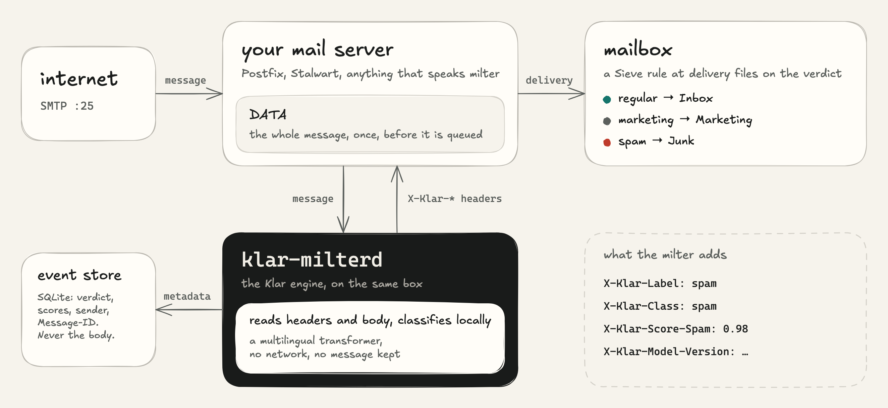

<div align="center">


# Klar Engine

**A transformer spam filter that runs on your own mail server.**

Stalwart, Postfix, or any libmilter MTA. The message never leaves the box.

[](https://github.com/klar-im/engine/actions/workflows/ci.yml)
[](https://github.com/klar-im/engine/releases/latest)
[](https://github.com/klar-im/engine/pkgs/container/klar-milterd)
[](https://github.com/klar-im/engine/releases/latest)
[](LICENSE)
[](LICENSE-MODEL.md)

[Install](#install) · [Stalwart](stalwart/README.md) · [Postfix](postfix/README.md) · [Embed](#embed-it) · [klar.im](https://klar.im)

</div>

## Why Klar

- **On your server.** The milter reads the message at DATA, scores it on the
  same box and writes its verdict into headers. It stores metadata only, never
  the message.
- **A real language model, not regexes.** A multilingual transformer encoder
  (`intfloat/multilingual-e5-base`, fine-tuned by Klar) on llama.cpp, CPU only,
  304 MB quantized.
- **Three classes, not one score.** Spam, marketing and regular mail, so a
  newsletter can go to its own folder instead of Junk.
- **Try it before you trust it.** On Stalwart, shadow mode keeps the built-in
  filter scoring beside Klar, so you compare the two on your own mail first.
- **One line to install.** Prebuilt x86_64 and arm64 tarballs, a multi-arch
  image, a systemd unit. No weights in this repo: the model downloads on first
  start, verified file by file.

## Install

On Linux (x86_64 or arm64, systemd), from the release binaries:

```bash
curl -fsSL https://raw.githubusercontent.com/klar-im/engine/main/install.sh | sudo KLAR_ACCEPT_MODEL_LICENSE=1 sh
```

`KLAR_ACCEPT_MODEL_LICENSE=1` records that you accept the model's licence
(CC-BY-NC-4.0, `LICENSE-MODEL.md`); the installer downloads the model,
verified file by file, and starts the `klar-milterd` service. Then point
Stalwart at it with `stalwart-cli` admin credentials:

```bash
export STALWART_URL=http://127.0.0.1:8080 STALWART_USER=admin STALWART_PASSWORD=...
python3 /opt/klar/share/stalwart/scripts/apply.py --milter-host 127.0.0.1 --milter-port 8891
```

The full guide (shadow mode, per-mailbox filing, the container, sizing) is
[`stalwart/README.md`](stalwart/README.md). On Postfix, run the installer with
`KLAR_MTA=postfix` and follow [`postfix/README.md`](postfix/README.md).



*The figure is an Excalidraw scene,
[`postfix/docs/klar-milter.excalidraw`](postfix/docs/klar-milter.excalidraw);
open it at excalidraw.com to edit it.*

## What your mail gets

Every message comes out with `X-Klar-*` headers that a Sieve rule (or any
filter) can file on. These are the headers the milter writes, in the order it
writes them, for `engine/tests/data/demo-samples/spam.en.eml` through the
released model (gen3-v6) in `tag` mode:

```text
X-Klar-Event-ID: <a UUID, one per message>
X-Klar-Label: spam
X-Klar-Class: spam
X-Klar-Score-Spam: 0.896582
X-Klar-Score-Regular: 0.017817
X-Klar-Score-Marketing: 0.085601
X-Klar-Score-Gibberish: 0.000000
X-Klar-Action: tag
X-Klar-Model-Version: dab55c42-6eb5-464b-9e2a-271fd1867a19
```

`X-Klar-Label` is the binary verdict (`spam` or `regular`) that files to Junk,
`X-Klar-Class` is the three-class argmax that files a promo to Marketing, and
`X-Klar-Action` is what the milter did (`tag`, `reject` or `bypass`). The label
is gated on a calibrated spam side the headers do not carry, so file on
`X-Klar-Label`, never on a score threshold. `X-Klar-Event-ID` and
`X-Klar-Model-Version` (the model's uuid) trace a verdict back;
`X-Klar-Score-Gibberish` is always `0.000000`, a fourth class older models
scored, kept so the header set never changes. The full header contract is in
[`postfix/SPEC.md`](postfix/SPEC.md).

## What's here

This repo is the open core of [Klar](https://klar.im): the engine, the milter
built on it, and the Stalwart wiring.

- `engine/` is the C++ inference core: a GGML/llama.cpp encoder plus a
  model-declared classifier head, with a stable C ABI
  (`engine/spam_engine_c_api.h`) for embedding in other languages.
- `postfix/` is the milter: one daemon for Postfix, Stalwart and any libmilter
  MTA (config, policy, event store, health endpoint, CLI) plus a Docker
  end-to-end stack (Postfix and Dovecot).
- `stalwart/` is the Stalwart wiring: config fragments, `apply.py` over
  `stalwart-cli`, the filing Sieve, a compose end-to-end stack.
- `install.sh` is the one-line installer for the release binaries.
- `AGENTS.md` is for an AI agent doing the install for you: what to check, what
  to run, and that the model licence stays your decision.

## Run it behind your mail server

- **Stalwart**: [`stalwart/README.md`](stalwart/README.md). Four objects
  applied through `stalwart-cli` (`stalwart/scripts/apply.py`, idempotent), a
  per-mailbox Sieve include, and the shadow mode.
- **Postfix**: [`postfix/README.md`](postfix/README.md). The same daemon with
  OpenDKIM and OpenDMARC ahead of it, a systemd unit, and a Docker end-to-end
  stack.
- **The binaries**: every release attaches `klar-milterd-<version>-linux-x86_64.tar.gz`
  and `-linux-arm64.tar.gz` (with `.sha256`), built by this repo's CI on
  glibc 2.35 (x86_64) and 2.39 (arm64) with every other library bundled and
  no weights. `install.sh` installs them; read it before piping it to a shell.
- **The image**: `ghcr.io/klar-im/klar-milterd` (linux/amd64 and linux/arm64),
  built from `postfix/docker/Dockerfile` with no weights; the container
  fetches the model into its volume on first start, only with
  `KLAR_ACCEPT_MODEL_LICENSE=1`.

## Build from source

```bash
make setup                                   # C/C++ deps (llama.cpp, gmime, xxhash, json)
KLAR_ACCEPT_MODEL_LICENSE=1 make model       # fetch the production model, verified against the pinned manifest
make build
./engine/build/spam_classifier ./engine/model engine/tests/data/demo-samples/spam.en.eml   # prints: spam
```

The engine ships with no weights. You load a model directory at runtime. The
default is the production model, the same classifier the Klar apps ship,
pinned by `postfix/model/released-manifest.json` and fetched by
`fetch_model.sh` (today gen3-v6, Klar's fine-tune of the MIT-licensed
`intfloat/multilingual-e5-base` encoder, a 304 MB Q8_0 GGUF plus a three-class
head), distributed under CC-BY-NC-4.0 (free for non-commercial use with
attribution; commercial use needs a paid licence, see `LICENSE-MODEL.md`).
`make model` downloads the seven files the manifest pins into `engine/model/`
and checks every one by digest; it refuses to start until
`KLAR_ACCEPT_MODEL_LICENSE=1` records that you accept `LICENSE-MODEL.md`. The
same script is what the milter container runs on first start.

<details>
<summary><b>Run your own classifier instead</b></summary>

`make import MODEL=<hf-repo>` converts any XLM-RoBERTa spam model from Hugging
Face (encoder to GGUF, head extracted). It installs the Python conversion deps
(`engine/requirements-import.txt`) and needs `convert_hf_to_gguf.py` from
llama.cpp (on PATH after `make setup` on macOS); use a virtualenv if your distro
marks the system Python externally-managed. `MODEL` defaults to Klar's first
public model, `icosha/spam-xlmr-v1`, which is not the production model any more.

</details>

## Embed it

The engine is a C ABI you link into a client or server. Load a model once,
then classify.

<details>
<summary><b>C ABI, Node.js binding, on-device training</b></summary>

- `engine/spam_engine_c_api.h`: `classify(text, sender_name, sender_email, mode)`
  for plain text (short and social messages included), or `classify_rfc822(...)`
  for a full `.eml`, which handles the MIME parse, multipart part selection, and
  sender-auth extraction. From Swift, C#, Rust, and similar languages it is a
  P/Invoke or FFI call over the same ABI.
- `engine/node/` ([`@klar/engine`](engine/node/README.md)): a Node.js N-API
  binding with `classifyText` and `classifyEml` for Electron and Node clients.
- `engine/spam_engine_training_c_api.h`: on-device learning. `train_rfc822`,
  `add_training_sample`, and `train_incremental` learn from user corrections
  (marking a message as spam) locally. Nothing leaves the machine; centralized
  or flywheel retraining is separate and not in this repo.

`postfix/` is a full worked example: the same C ABI embedded in a Postfix
milter. `postfix/scripts/train_from_imap.py` shows the training loop over an
IMAP folder.

</details>

## Licence

- **Code**: AGPLv3 (`LICENSE`). The network-use copyleft means that if you offer
  this as a service, your modifications must be shared. Commercial licences
  without the AGPL obligations are available; contact hello@klar.im.
- **Model**: separately licensed (`LICENSE-MODEL.md`) under CC-BY-NC-4.0: free
  for non-commercial use with attribution, paid licence for commercial use.
- **Dependencies**, and why each is compatible (libmilter's Sendmail License
  included): `THIRD_PARTY_LICENSES.md`.

## Contributing

Issues and pull requests are welcome; `CONTRIBUTING.md` explains how a change
travels through the mirror (this repo is published from Klar's monorepo, so a
direct edit here is carried back by hand). Vulnerabilities go to
security@klar.im, not the tracker: `SECURITY.md`.
