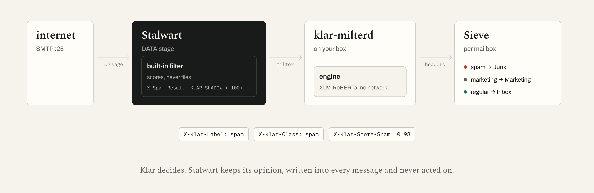

# Klar for Stalwart

Run the Klar spam engine on a [Stalwart](https://stalw.art) mail server, in
place of Stalwart's built-in rule filter. Stalwart hands every inbound message
to `klar-milterd` over the milter protocol, the engine classifies it on your
box (nothing leaves the server), and a per-mailbox Sieve rule files on the
verdict. This is how [klar.im](https://klar.im)'s own mail runs.



## Why the built-in filter has to stop deciding

Stalwart runs its own spam filter **before** the milters and records the
outcome as a per-recipient flag that decides Junk filing at delivery
(`crates/smtp/src/inbound/data.rs`, 0.16.18: filter at `:531`, flag at `:566`,
`run_milters` at `:602`; `crates/email/src/message/ingest.rs:357` files on the
flag). A header the milter adds cannot clear that flag, so two filters would
run and the built-in one would win every disagreement. Turning it off is the
whole point, not a side effect: on our own mail its rules junked Apple's
TestFlight invitation at a score of 8.90 with DKIM, SPF and DMARC all passing
(`SPOOF_REPLYTO` because Apple's Reply-To domain differs from its From domain,
`MIME_MA_MISSING_TEXT` because the mail was HTML-only).

## Install

You need a Stalwart 0.16 server you administer (`stalwart-cli` with admin
credentials) and a Linux host for the milter. Everything is idempotent; run it
again and it changes nothing. A brand-new Stalwart is in bootstrap mode until
its setup wizard has run (every management call answers "forbidden: The
server is in bootstrap mode"); finish the wizard in the WebUI first, or do
what the E2E does and `stalwart-cli update Bootstrap singleton` with your
hostname and domain, then restart.

### 1. The milter

Build from source on the host (Ubuntu/Debian shown; `make setup` prints the
package list for others):

```bash
git clone https://github.com/klar-im/engine && cd engine
sudo apt-get install -y libmilter-dev libsqlite3-dev
make setup && make build
sudo postfix/scripts/install.sh /opt/klar                 # binary + libraries in /opt/klar/bin
sudo useradd --system --no-create-home --shell /usr/sbin/nologin klarmilter
sudo mkdir -p /var/lib/klar /etc/klar && sudo chown klarmilter:klarmilter /var/lib/klar
sudo KLAR_ACCEPT_MODEL_LICENSE=1 postfix/scripts/fetch_model.sh /var/lib/klar/model
sudo cp stalwart/config/klar-milterd.toml /etc/klar/
sudo cp postfix/packaging/klar-milterd.service /etc/systemd/system/
sudo systemctl enable --now klar-milterd
curl -fsS http://127.0.0.1:8892/readyz                     # "ok" once the model is loaded
```

Or the container, which builds the same binary and fetches the same model into
its volume on first start (the image carries no weights):

```bash
docker build -f postfix/docker/Dockerfile -t klar-milterd .
docker run -d --name klar-milterd -e KLAR_ACCEPT_MODEL_LICENSE=1 \
  -v klar-data:/var/lib/klar -p 8891:8891 -p 127.0.0.1:8892:8892 klar-milterd
```

The model is licensed separately from the code (`LICENSE-MODEL.md`:
CC-BY-NC-4.0, free for non-commercial use with attribution, a paid licence for
commercial use). `fetch_model.sh` refuses to download it until
`KLAR_ACCEPT_MODEL_LICENSE=1` says you have read that.

`stalwart/config/klar-milterd.toml` is the milter's config for this
deployment. Two settings differ from a Postfix install and both matter:

- `auth_results = "ignore"`. Stalwart writes its `Authentication-Results`
  **after** the milters run and hands the milter the message as the client
  sent it, so any `Authentication-Results` the milter sees is the sender's own
  claim. The engine reads that header and trusts the topmost one; a forged
  `dkim=pass header.d=paypal.com` on a phish from `paypal.com` would buy it a
  strong ham rescue. `ignore` drops every such header before the engine sees
  the message. Do not set `trust-topmost` behind Stalwart.
- `listen`. `127.0.0.1` when Stalwart is on the same host. In a container or
  another network namespace, bind an address Stalwart can reach
  (`inet:8891@0.0.0.0`); the Dockerfile does this.

Sizing: about 700 MB of RSS with the model loaded, one classification at a
time. Speed is the CPU's: on klar.im's 2-vCPU VPS (AMD EPYC 7281, shared with
Stalwart and a website) the median is 6 s per message and the 90th percentile
12 s, measured over a day of real mail; a desktop CPU is several times faster
and Apple Silicon classifies in tens of milliseconds. Stalwart waits 60 s for
the milter (`timeoutData`) and delivers unclassified past that, never defers.
`postfix/README.md` has the detail; the milter is the same daemon Postfix
users run.

### 2. The Stalwart side

`stalwart/scripts/apply.py` declares four objects through `stalwart-cli` and
reloads settings once if anything changed:

| Object | What it sets | Fragment |
|---|---|---|
| `MtaMilter` | klar-milterd at `--milter-host:--milter-port`, DATA stage, `enable = is_empty(authenticated_as)` (inbound only, never your users' own submissions), `tempFailOnError false` (a milter outage delivers unclassified; it never defers mail) | `config/mta-milter.json` |
| `SenderAuth` | `dmarcVerify = strict` on port 25: a message failing DMARC under a `p=reject` policy is refused at SMTP time. Stalwart keeps verifying; only its *filing* stops | `config/sender-auth.json` |
| `SieveUserScript` | the global user script `klar` (the filing rules, `sieve/klar.sieve`) | |
| `MtaStageData` | `enableSpamFilter = false`: the built-in filter no longer runs, so `X-Spam-Result` disappears. An `X-Spam-Status: No` still appears on every message: ingest writes it from a per-recipient flag that nothing sets any more (`crates/email/src/message/ingest.rs`, under the global `spam-filter.enable`). Informational; it is not the classifier | `config/stage-data.json` |

```bash
export STALWART_URL=http://127.0.0.1:8080 STALWART_USER=admin STALWART_PASSWORD=...   # as for stalwart-cli
python3 stalwart/scripts/apply.py --milter-host 127.0.0.1 --milter-port 8891           # --dry-run to see the plan
```

`STALWART_CLI=/path/to/stalwart-cli` if it is not on `PATH`. A milter has no
name in Stalwart, so its endpoint is its identity: when the milter moves (a
container's new address), re-run with `--milter-id <id>` naming the object to
re-point; without it the run refuses to add a second milter beside one it
cannot account for, and prints the ids. The same in the
WebUI, if you prefer clicking: Settings › MTA › Filters › Milters (add one),
Settings › Spam filter › General (disable), Settings › MTA › Authentication
(DMARC strict), Settings › Sieve › User scripts (paste `sieve/klar.sieve` as
`klar`).

### 3. The mailboxes that should file

Filing happens in each account's active Sieve script, because that is where
Stalwart files. `sieve_activate.py` installs a one-line
`include :global "klar"` and activates it, over JMAP for Sieve (RFC 9661),
with the **account's** credentials:

```bash
STALWART_PASSWORD='alice-pw' python3 stalwart/scripts/sieve_activate.py --url https://mail.example.com --user alice@example.com
```

An account that already runs a Sieve script of its own is refused (exit 3):
JMAP allows one active script per account, so activating ours would switch
theirs off. The refusal prints the two lines (`require ["include"];` and
`include :global "klar";`) to add to that script instead.

Do this for the mailboxes people read. Do **not** do it for a mailbox whose
contents are the point (a spam trap, an abuse@ or a corpus mailbox): it gets
`X-Klar-*` headers on every message and nothing moves, which is exactly the
value of a trap that also records a verdict. Users can also paste
`sieve/klar.sieve` into their own filters through the webmail or ManageSieve;
the global script only saves everyone from doing that.

Rules are updated by re-running `apply.py` after editing `sieve/klar.sieve`;
the per-account include never changes. The spam label wins: a message labelled
spam goes to Junk even when its class is marketing. `fileinto :specialuse
"junk"` finds the Junk folder whatever it is called ("Junk Mail", "Spam");
note the spelling: Stalwart matches the bare role name, and RFC 8579's
`"\Junk"` fails the lookup silently and creates a second folder.

## Shadow mode: keep Stalwart's opinion, drop its decision

`apply.py --shadow` leaves Stalwart's filter running and adds one tag,
`KLAR_SHADOW`, at -100 to every message, so the total can never reach the junk
threshold (5): Stalwart writes `X-Spam-Result` with every rule it fired but
files nothing, while the milter decides. `X-Spam-Result` minus `KLAR_SHADOW`
is what Stalwart would have done to each message.

Two ways to use it. As a **comparison window** when migrating: run shadow for
a fortnight, count the disagreements, then re-run `apply.py` without
`--shadow` to remove the tag and rule and turn the filter off. Or **keep it**,
which is what klar.im does: every message we receive then carries two
independent verdicts, ours deciding and Stalwart's recorded, and a filter you
can compare yourself against on your own mail is worth the few milliseconds
its rules cost. klar.im's count is `make company/mail-spam-audit
ARGS="--exclude-tag KLAR_SHADOW"`; the first fortnight's result is in the launch
post.

## What the engine gives up behind Stalwart, and what closes it

With `auth_results = "ignore"` the engine never sees a DMARC result. Where a
brand's domain is forged directly and that brand publishes `p=reject`,
Stalwart refuses the message before the milter (`dmarcVerify strict`). Where
the brand publishes `p=quarantine` or `p=none`, the engine reads the message
as unauthenticated: it still condemns on content, look-alike domains, display
names and the rest, but the one signal it cannot have is "DMARC positively
failed". Behind Postfix that signal comes from OpenDMARC stamping a trusted
header ahead of the milter; Stalwart computes the same result and does not yet
pass it to milters or MTA hooks (`hooks/message.rs` sends
`server_headers: vec![]`). The proper fix is upstream, a small change that
fills that field, and it is filed; until it ships, this paragraph is the
residual.

## Try it in one command

`stalwart/docker-compose.yml` runs upstream's Stalwart image beside the milter
built from this tree; `stalwart/scripts/test_e2e.sh` (or `make stalwart/test`)
creates a domain and two accounts, applies both modes, sends a GTUBE, a ham and
a forged-`Authentication-Results` phish over SMTP, and reads back over JMAP
where each landed and with which headers.

## Files

```
stalwart/
  config/klar-milterd.toml     the milter's config for this deployment
  config/mta-milter.json       MtaMilter object (hostname/port substituted by apply.py)
  config/stage-data.json       MtaStageData patch: enableSpamFilter false
  config/sender-auth.json      SenderAuth patch: dmarcVerify strict on :25
  config/shadow.json           the KLAR_SHADOW tag + rule for --shadow
  sieve/klar.sieve             the filing rules, published as global script "klar"
  scripts/apply.py             declare it all through stalwart-cli, idempotent
  scripts/sieve_activate.py    activate the include on one account (JMAP for Sieve)
  scripts/test_e2e.sh          the compose E2E
  docker-compose.yml           Stalwart + klar-milterd
  tests/                       apply.py against a fake stalwart-cli
```

Licence: the code is AGPLv3 (`LICENSE`), the model CC-BY-NC-4.0
(`LICENSE-MODEL.md`). Issues and pull requests at
[github.com/klar-im/engine](https://github.com/klar-im/engine).
